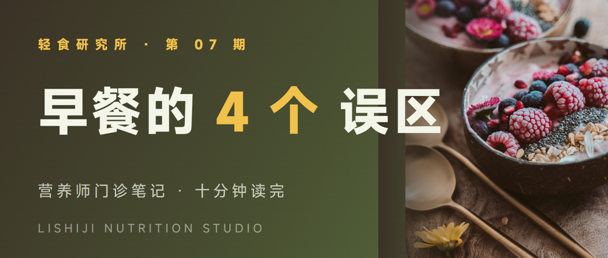
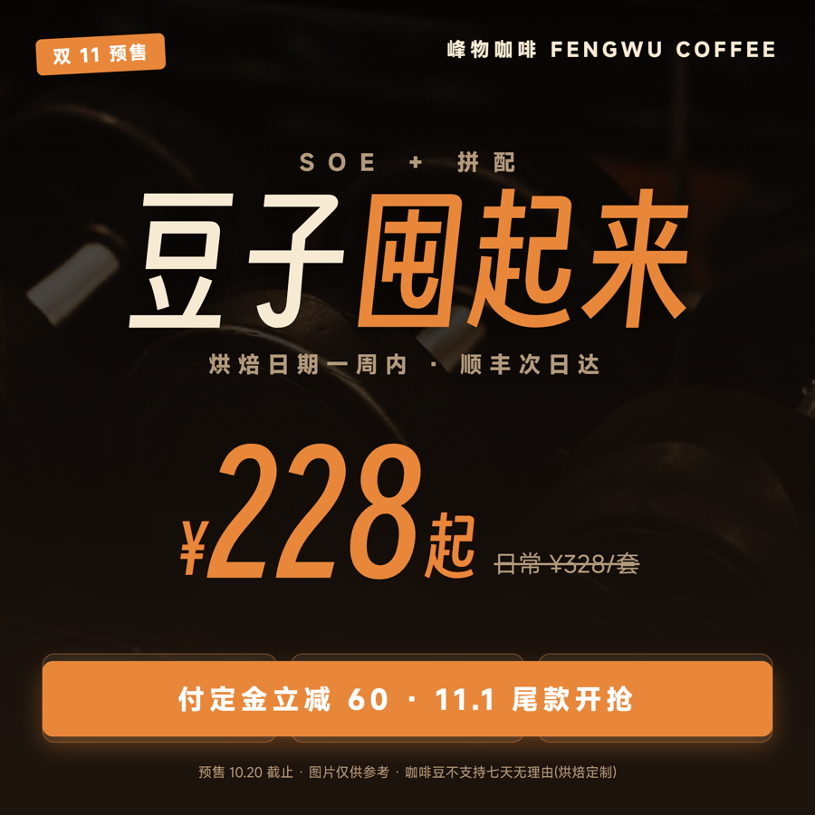
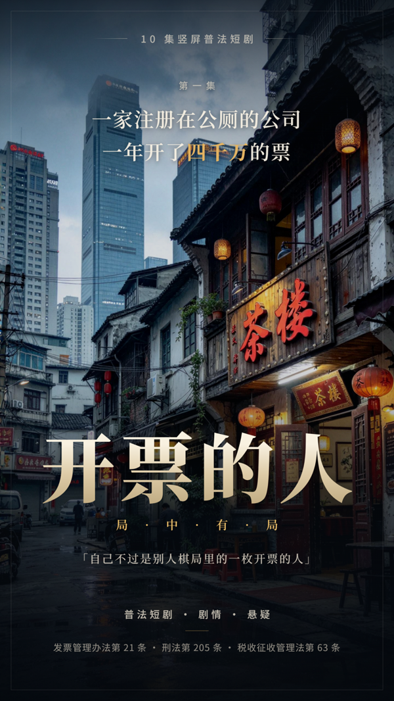

<p align="center">
  
</p>

<h1 align="center">artboard · HTML 海报工作室</h1>

<p align="center">
  <strong>AI Agent Skill:让 AI 像设计师一样工作</strong><br>
  不调用 AI 生图,而是写 HTML/CSS、用真实摄影素材、按印刷规范排版,<br>
  再经 Playwright 渲染成成品图——文字永远锐利,配色永远可控,结果永远可复现。
</p>

---

## ✨ 成品样例

<table>
<tr>
<td align="center" width="25%"><br><sub>小红书封面 · 轻食研究所</sub></td>
<td align="center" width="25%"><br><sub>公众号封面 · 栗食记</sub></td>
<td align="center" width="25%"><br><sub>电商主图 · 铁象健身</sub></td>
<td align="center" width="25%"><br><sub>科技发布 KV · 青梧智联</sub></td>
</tr>
<tr>
<td align="center"><br><sub>A4 海报 · 城市之声室内乐</sub></td>
<td align="center"><br><sub>电影海报 · 开票的人</sub></td>
<td align="center"> <br><sub>名片 · 正/背 · 闻山律所</sub></td>
<td align="center"> <br><sub>三折页 · 半山云宿</sub></td>
</tr>
<tr>
<td align="center" colspan="2"><br><sub>数据长图 · 城市咖啡图鉴</sub></td>
<td align="center" colspan="2"><br><sub>易拉宝 80×200cm · 青梧智联校招</sub></td>
</tr>
</table>

> 每张均为本技能端到端产出:Pexels 授权摄影 / 开源字体(MiSans、得意黑、文楷等)/ 手写 CSS 排版与特效,300dpi 印刷直出。

## 🎯 它解决什么问题

AI 生图工具做海报的三座大山:**文字必糊、配色看运气、改一个字重跑一次**。artboard 反其道而行:

| | AI 生图 | artboard |
|---|---|---|
| 文字 | 概率性糊字/错字 | HTML 渲染,永远锐利可编辑 |
| 配色 | 每次随机 | 设计 token 锁定,改一处全局生效 |
| 迭代 | 改一字重跑全图 | 定点修改 HTML,秒级重导 |
| 素材 | AI 幻觉 | 真实摄影(Pexels 授权/用户提供) |

## 🔄 工作流水线

<p align="center">
  
</p>

- **开工先追问**:内置五问协议(用途/尺寸/风格/配色/素材),拒绝拿到文案就盲做;
- **双路径导出**:WPI(Playwright 驱动系统 Edge/Chrome)为主,独立 Playwright 脚本兜底;
- **出图自检闭环**:渲染后自动看图检查溢出/对比度/字体加载,修复重导,2 轮上限;
- **动图**:CSS 动画 → GIF/MP4,迪士尼十二法则 + Material 缓动 token,无缝循环经帧差校验;
- **物料尺寸总表**:社媒/电商/印刷/办公/广告 40+ 物料的尺寸、安全区与设计法则。

## 🚀 快速开始

把 `artboard/` 放进 Agent Skill 目录(如 `.agents/skills/`),然后直接对话:

```text
「给山雾茶町做一张 88 会员日的咖啡促销方图,产品图我有」
「按这张图复刻内容,换成我们的品牌色」
「做一份三折页,A4 横,正面背面都要」
「这张 GIF 动图,循环 3 秒」
```

**第 2 步 · 拿两把免费图库 Key(各 5 分钟)**

| 平台 | 步骤 |
|---|---|
| [Pexels](https://www.pexels.com/zh-cn/) | 注册 → 验证邮箱 → 补基础信息 → 悬停右上角「…」→「图片和视频 API」→ 填名称与用途 → 即刻发放 |
| [Pixabay](https://pixabay.com/) | 注册 → 验证邮箱 → 打开 [api/docs](https://pixabay.com/api/docs/) → 找「Your API key」→ 复制 |

**第 3 步 · 填配置(图形界面)**

双击 `tools\config-editor\artboard-config-editor.exe`(纯 tkinter 零依赖,已编译 exe),
逐项填写后点保存——即改即生效,不用重启。

**第 4 步 · 一键部署运行环境**(`artboard\scripts\` 下)

```bat
python setup_wpi.py          :: WPI 渲染引擎(GitHub 自动下载+装依赖)
python setup_ffmpeg.py       :: FFmpeg(可选:MP4 + 高质量 GIF)
python fetch_model.py vqa    :: 本地 VQA 模型(可选:离线看图问答)
python fetch_model.py ocr    :: 本地 OCR 模型(可选:离线文字识别)
```

**第 5 步 · 体检**

```bat
python scripts\preflight.py
```

打印环境自检报告:就绪几项、待补几项、每项怎么补。全部 ✓ 即可开工。

## 📐 品类与尺寸

| 品类 | 预设 | CSS 画布(px) | 导出 |
|---|---|---|---|
| 小红书 3:4 | `xhs` | 1080×1440 | 2x = 2160×2880 |
| 长图 / KV / 方图 / 竖屏 | `long` `kv` `square` `vertical` | 2400×auto 等 | 1–2x |
| 名片 90×54mm | `card` | 1063×638 | 1x = 300dpi |
| A4 海报 | `a4p` | 1240×1754 | 2x = 300dpi |
| 三折页(双面) | `trifold` | 1754×1240 | 2x = 300dpi + 合 PDF |
| 易拉宝 80×200cm | `rollup` | 2362×5906 | 2x = 150dpi |
| PPT 页 16:9 | `slide` | 1280×720 | 2x = 2560×1440 |
| 公众号封面 | `gzh` | 900×383 | 2x |
| 电商主图 | `taobao` | 800×800 | 2x |

> 完整 40+ 物料尺寸(含社媒/广告/印刷)见 [material-catalog.md](references/material-catalog.md)。

## ⚙️ 配置

环境统一在根目录 `config.json`(复制 `config.example.json`,已被 gitignore):

| 键 | 说明 |
|---|---|
| `wpi_path` | WPI 渲染引擎路径(Playwright + 系统 Edge/Chrome) |
| `studio_dir` | 海报项目与素材库落盘目录 |
| `pexels_key` / `pixabay_key` | 免费图库 API key |
| `*_cookie` | 素材站 Cookie,用 [tools/cookie-extension](tools/cookie-extension/)(MV3)一键抓取 |
| `proxy` | 本地代理(访问境外源用) |
| `ffmpeg` | 可选,启用 MP4 与高质量 GIF |
| `vision_mode` | `auto`(Agent 视觉优先)/ `local`(强制本地 VQA/OCR) |
| `vqa_path` / `ocr_path` | 本地 VQA / OCR 模块路径(`fetch_model.py` 自动部署) |

优先级:环境变量 > config.json > 默认值。改完即生效。

## 🧩 矢量交付与工程文件(WebHtml2VectorEdit)

默认流水线产出 PNG/JPG 等成品图;当用户需要**设计软件可编辑的工程文件**时,
自写核心 **WebHtml2VectorEdit** 把 HTML 转成矢量产物(与 WPI 无关,
相似度以 SSIM 验收,三样张实测 0.97–0.99):

```bash
python scripts/setup_vector.py                       # 一次性部署 poppler + Ghostscript
python scripts/ai_export.py <项目目录>                # 一键:分层 AI 可编辑 PDF
python scripts/ai_export.py <项目目录> --svg --eps --ai   # 追加 SVG / EPS / 真 .ai
```

| 产物 | 说明 |
|---|---|
| `*-ai.pdf` | **AI 可编辑 PDF**:背景/内容 双图层(OCG)+ 整句可编辑文字(逐字断层自动合并),PDF 阅读器可直接开关图层 |
| `*.ai` | 真 .ai 源文件(原生构建):按 DOM 组件树在 Illustrator 内递归建**嵌套真组**(Ctrl+G 语义,非剪切蒙版),文字为整句 TextFrame,背景/内容双层 |
| `*.svg` | 全矢量、文字转曲、图片内嵌,网页/Figma/AI 通吃 |
| `*.eps` | 老印刷流程用(透明自动压平) |
| `*-reference.png` + `*-diff-*.png` | SSIM 相似度验收:基准截图 + 逐格式差异热区 |

**逆向重维护**:`VectorEdit2WebHtml` 把 PDF/EPS/SVG/.ai 变回可维护 HTML——

```bash
python scripts/vectoredit2webhtml.py poster-ai.pdf rebuild.html               # 视觉完整(底景+可选文字)
python scripts/vectoredit2webhtml.py poster-print.pdf rebuild.html --mode editable  # 纯文字+照片,改完可重导
```

写 HTML 时请遵守 **矢量安全清单**(vector-export.md §5,五条禁令:
禁硬切透明渐变/blend-mode/渐变字/conic-gradient/alpha 渐变压圆角),
否则转换会脏色、丢字或出伪影。注意:工程文件导出**不在默认流水线**,
仅按需运行;文字/图形分层细则与验收协议见
[references/vector-export.md](references/vector-export.md)。

## 📦 脚本一览

```bash
python scripts/preflight.py                                    # 环境自检报告
python scripts/fetch_asset.py --query "…" --theme t --download # 搜图/下载
python scripts/cutout.py product.jpg --sticker --shadow        # 抠图+投影
python scripts/qr.py generate --data "…" --out img/qr.png      # 品牌二维码
python scripts/qr.py decode poster.png                         # 解析二维码内容
python scripts/export.py --source src --output out.png \
    --width 1080 --scale 2 --height 1440                       # 导出
python scripts/make_bats.py <项目>                              # 生成双击导出 bat
python scripts/calc_size.py mm 210 297 --dpi 300               # 印刷尺寸计算器
python scripts/compare.py 参考图 复刻图                          # 复刻并排比对
python scripts/vqa.py image.jpg --prompt "描述这张图"           # VQA 看图问答
```

## 📁 目录结构

```
artboard/
├── SKILL.md                 # Agent 入口:流水线 + 铁律
├── config.example.json      # 复制为 config.json
├── references/              # 设计知识分册
│   ├── intake.md            #   开工五问追问(防盲做)
│   ├── guardrails.md        #   设计护栏 + 反 AI 味自检 12 条
│   ├── pipeline.md          #   流水线细则 + 动效规范
│   ├── style-system.md      #   布局原型 + 配色系统
│   ├── effects.md           #   视觉特效 30+ 配方
│   ├── title-fx.md          #   标题手法(描边/蒙版/模糊/重组)
│   ├── typography-rules.md  #   排版硬规则(断行/层级/留白/数字)
│   ├── materials.md         #   素材管线(找图/抠图/版权)
│   ├── print-cmyk.md        #   打印 CMYK 流程 + 安全色谱
│   ├── replicate.md         #   图片复刻协议
│   ├── export.md            #   导出手册
│   ├── style-guide.md       #   新增风格指南
│   ├── styles-catalog.md    #   145 风格方向速查
│   ├── styles/              #   4 个视觉风格分册(+参考案例)
│   └── formats/             #   名片/A4/三折页/易拉宝/PPT 品类规范
├── scripts/                 # preflight/scaffold/export/cutout/fetch_asset
│   │                        #   vqa/qr/add_font/setup_wpi/setup_ffmpeg
│   │                        #   fetch_font/make_bats/export_local
├── fonts/                   # 21 款开源中英文字体(内置 6 款代表)
├── assets/
│   ├── vendor/              # ECharts / GSAP
│   ├── icons/               # Tabler SVG 精选
│   ├── illustrations/       # Open Doodles(CC0)
│   └── cases/               # 各风格"及格线"参考案例 HTML
├── tools/
│   ├── cookie-extension/    # 素材站 Cookie 助手(MV3)
│   └── config-editor/       # 图形配置编辑器(exe)
└── docs/
    ├── setup.md             # 新手部署教程
    ├── samples/             # 成品展示图
    └── references/          # 风格参考图
```

## 🔑 素材与版权政策

| 层级 | 来源 | 授权 |
|---|---|---|
| 1 | [Pexels](https://www.pexels.com/) / [Pixabay](https://pixabay.com/) API | 免费商用免署名 |
| 2 | 爬虫(必应/百度/图标库/Pinterest/花瓣) | **不确定** → 自动加 `版权风险-` 前缀,交付时提醒更换 |

- 产品实拍图**只能用户提供**——真实产品是品牌资产,图库没有也不该编;
- 爬虫素材的 `版权风险-` 前缀任何环节不得移除;
- Cookie 只存本机 config.json(已被 gitignore),无任何上传。

## 🙏 致谢

设计方法论与规则提炼自(思想借鉴,代码自写):

| 来源 | 许可 | 借鉴内容 |
|---|---|---|
| [baoyu-skills](https://github.com/JimLiu/baoyu-skills) | MIT | 风格×布局×配色枚举 |
| [diagram-design](https://github.com/cathrynlavery/diagram-design) | MIT | 编辑纪律/删减哲学 |
| [stylekit](https://github.com/AnxForever/stylekit) | MIT | 风格 schema/反 AI 味自检/原子化方法 |
| [html-anything](https://github.com/nexu-io/html-anything) | Apache-2.0 | 物料分区范式 |
| [esther-design-system](https://github.com/esthersjw/esther-design-system) | CC BY-NC-SA | 暖底/去 AI 味思想(重写) |
| [Art](https://github.com/zhuxice-ctrl/Art) | 无(仅特效原理) | 视觉特效实验室 |
| [guizang-ppt/social-card](https://github.com/op7418) | AGPL | 踩坑规则思想(重写) |
| [rembg](https://github.com/danielgatis/rembg) | MIT | 本地抠图引擎 |

字体:思源黑体/宋体(Noto CJK)· 得意黑(Smiley Sans)· 霞鹜文楷(LXGW WenKai)· 站酷快乐体(ZCOOL KuaiLe)· MiSans(小米)· 阿里巴巴普惠体 3.0 · HarmonyOS Sans(华为)。

图标:[Tabler Icons](https://github.com/tabler/tabler-icons)(MIT) · 插画:[Open Doodles](https://www.opendoodles.com/)(CC0)。

## 📄 License

MIT
