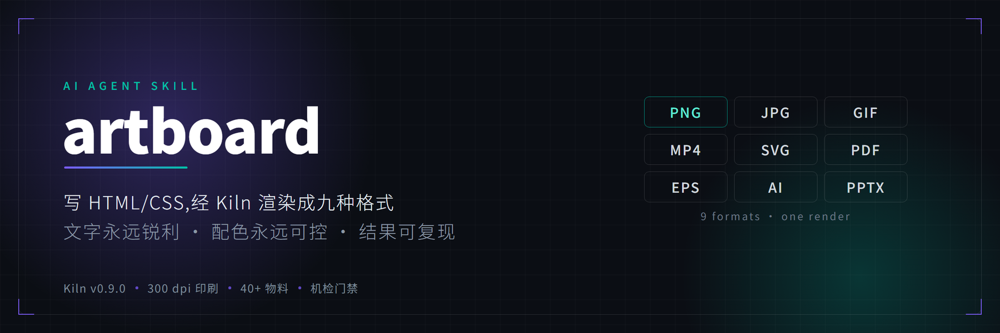
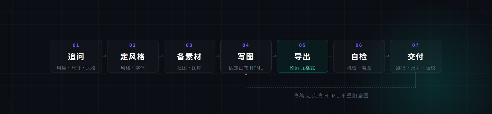
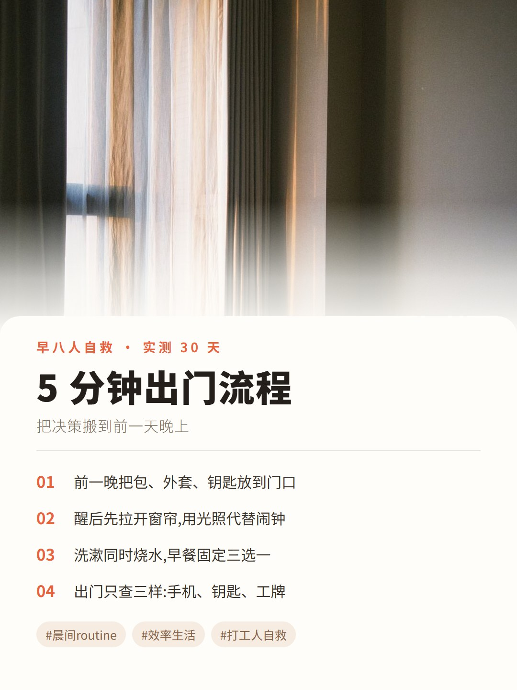
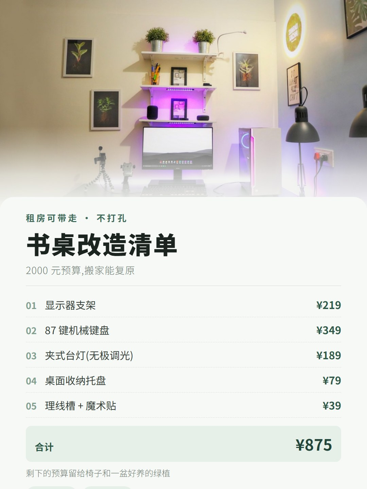
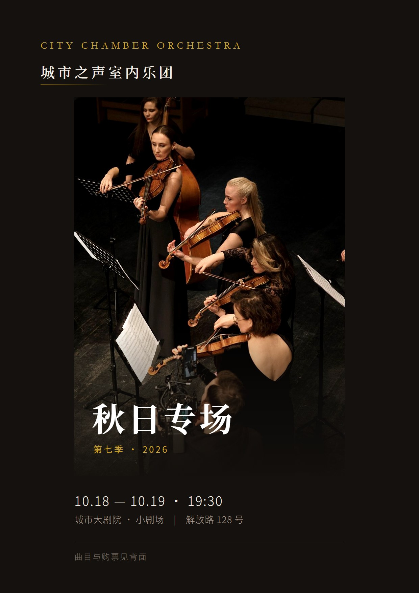
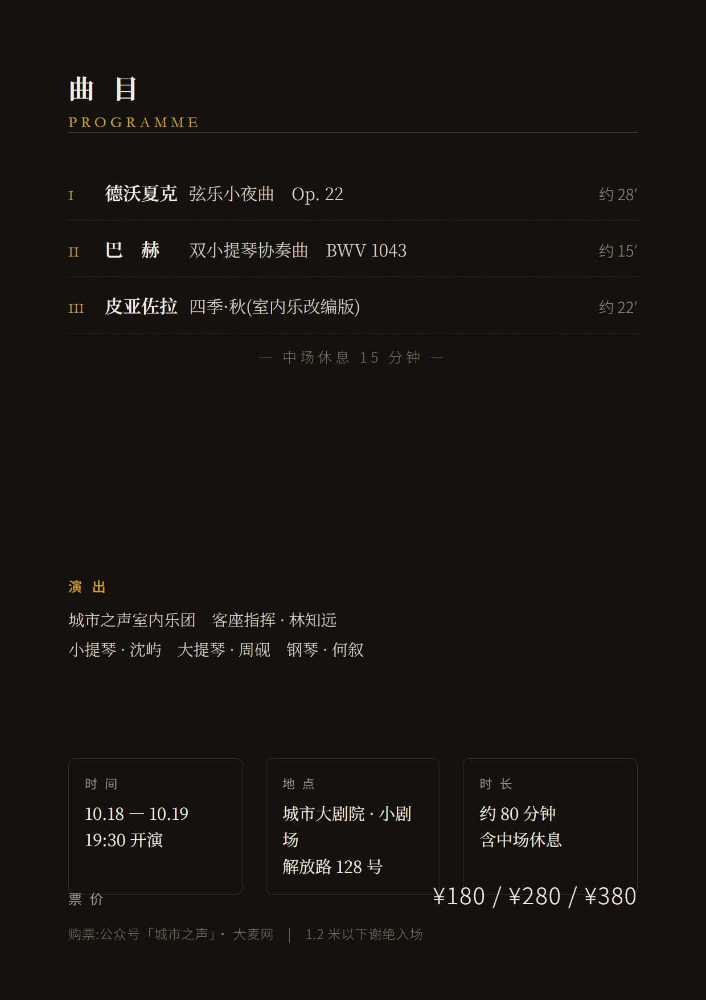
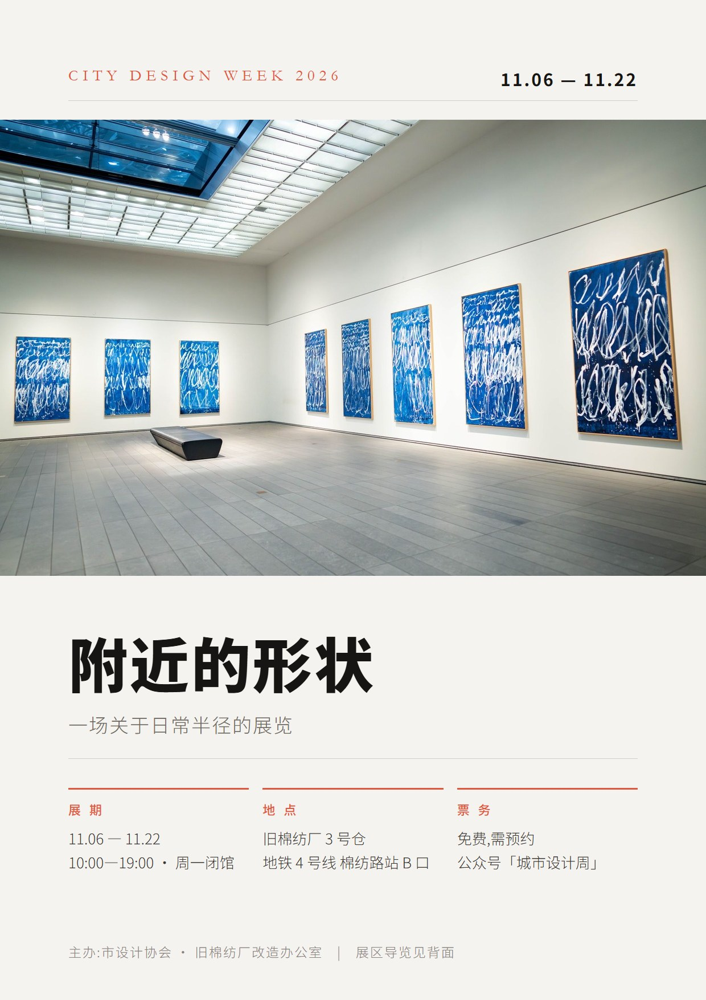
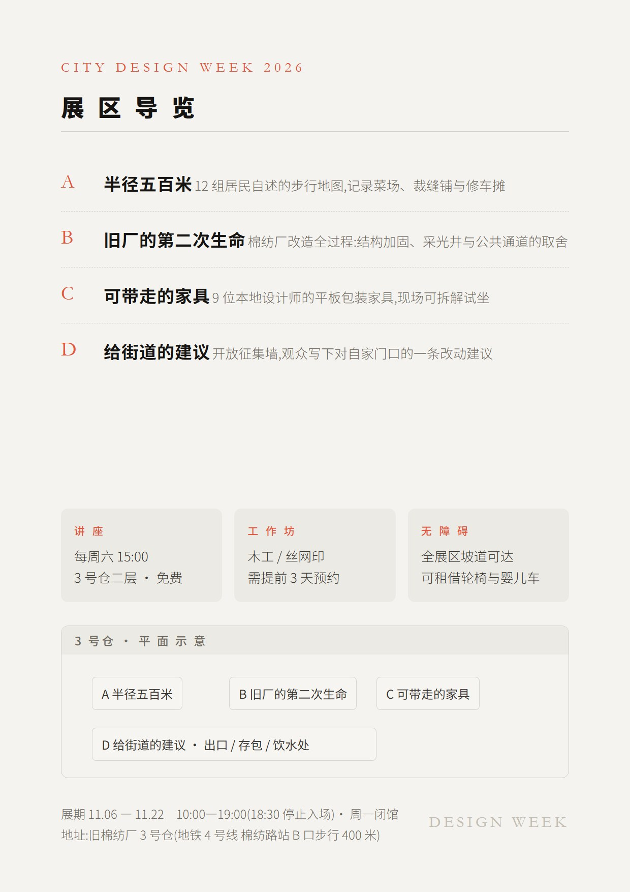
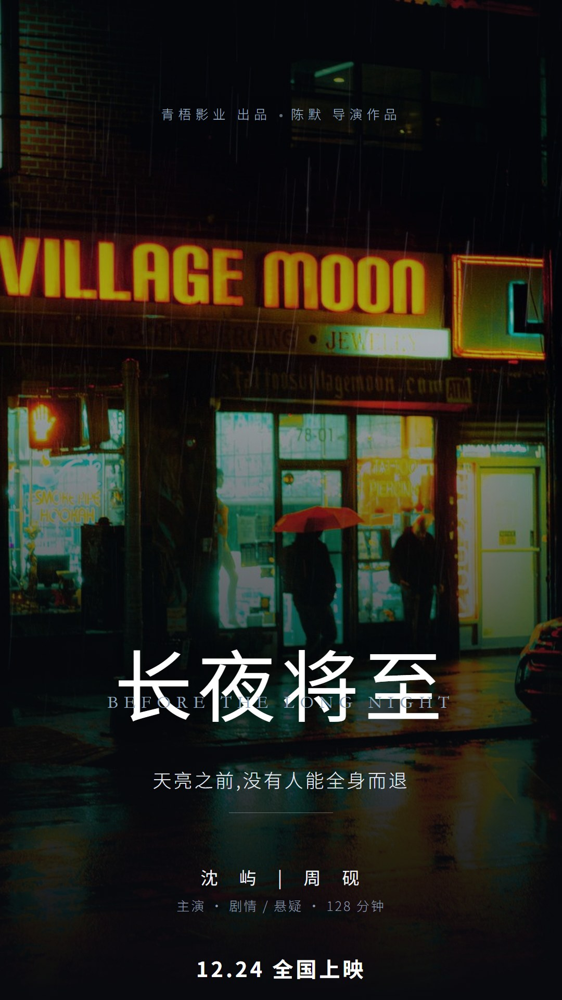
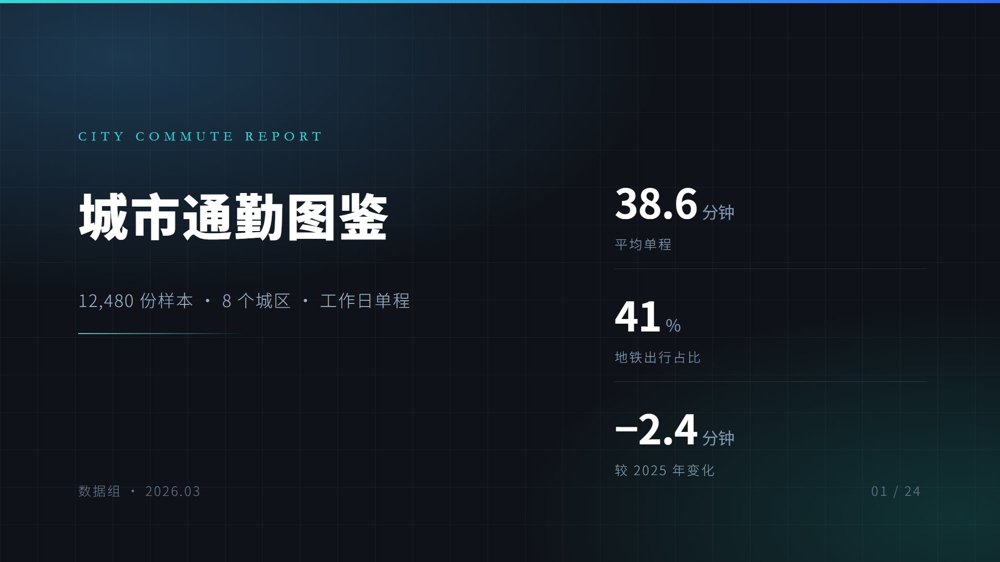

<p align="center">
  
</p>

<h1 align="center">artboard</h1>

<p align="center">
  <samp>AI Agent Skill · 让模型像设计师一样工作</samp><br>
  <samp>写 HTML/CSS → Kiln 原生引擎渲染 → PNG/JPG/GIF/MP4/SVG/PDF/EPS/AI/PPTX</samp>
</p>

<p align="center">
  <a href="#-成品样例"></a>
  <a href="LICENSE"></a>
  
  
  
</p>

---

不调 AI 生图。AI 生图的三件事它做不了：**文字要糊、配色看运气、改一个字重跑一次**。
artboard 反着来——设计 token 锁住配色，HTML 承载文字，Kiln 单文件引擎把同一份源码
渲染成九种格式。改稿是定点改 HTML，秒级重导，结果可复现。

| | AI 生图 | artboard |
|---|---|---|
| 文字 | 概率性糊字、错字 | HTML 渲染，永远锐利可编辑 |
| 配色 | 每次随机 | design token 锁定，改一处全局生效 |
| 迭代 | 改一字重跑全图 | 定点改 HTML，秒级重导 |
| 素材 | AI 幻觉 | 真实摄影（Pexels 授权 / 用户提供） |
| 交付 | 一张位图 | 位图 + 矢量 + 视频 + 工程文件 |

## 成品样例

<p align="center">
  
</p>

每张都是本技能端到端产出：Pexels 授权摄影 + 开源字体 + 手写 CSS 排版，
机检通过后由 Kiln 导出。同一版式内尺寸严格一致，换的是题材与气质。

### 小红书封面 · 1080×1440（3:4）

| | |
|---|---|
|  |  |
| *一周午餐盒* — 暖底手账 | *5 分钟出门流程* — 清单式干货 |
|  |  |
| *反复去的 6 家* — 探店清单 | *2000 元预算* — 价格清单 |

### A4 海报 · 正反面（210×297mm，300dpi）

| | |
|---|---|
|  |  |
| *城市之声室内乐* — 正面主视觉 | *曲目单* — 反面信息 |
|  |  |
| *城市设计周* — 正面主视觉 | *展区导览* — 反面导视 |

### 电影 / 广告海报 · 1080×1920（9:16）

| | |
|---|---|
|  |  |
| *开票的人* — 剧情片 | *长夜将至* — 悬疑片 |
|  |  |
| *屿* — 木质调香水 | *冰博客拿铁* — 饮品广告 |

### PPT 页 / KV · 1920×1080（16:9）

| | |
|---|---|
|  |  |
| *城市通勤图鉴* — 汇报封面 | *88 会员日* — 活动主视觉 |

### 长图 · 2400 宽

| |
|---|
|  |
| *城市咖啡图鉴* — 数据长图 |

> 渲染引擎：[GreenChennai/VellumBench](https://github.com/GreenChennai/VellumBench) 的
> Kiln 导出核心（Rust，自研），五用例固定基准以浏览器渲染为基线平均 **97.76/100**，
> 22 案例可编辑 PDF 对拍 **98.63/100**、文本一致率 100%。

## 工作流水线

- **开工先追问**：内置五问协议（用途/尺寸/风格/配色/素材），拒绝拿到文案就盲做；
- **单文件原生导出**：Kiln 引擎九格式零浏览器依赖，浏览器在位时走 Edge/Chrome 高保真车道，
  缺席自动降级自研引擎并在结果里声明；
- **机检门禁**：`check_overflow.py` 查文字越出容器、内容进字幕带、元素互相重叠，
  3–5 秒零 token，每次重导前都跑；
- **说不清也能改**：「不够高级 / 太乱 / 做减法」走改稿协议——五维诊断 + 减法阶梯，定点修改不重跑；
- **多稿同出（可选）**：用户说「多稿 4」才触发，4 方向 + 2×2 联络表，默认永远单稿；
- **动图**：CSS `@keyframes` 逐帧求值直出 GIF/MP4，双模式——海报循环（P）/ 视频场景卡（S）。

## 快速开始

把 `artboard/` 放进 Agent Skill 目录（如 `.agents/skills/`），然后直接对话：

```text
「给山雾茶町做一张 88 会员日的咖啡促销方图，产品图我有」
「按这张图复刻内容，换成我们的品牌色」
「做一份三折页，A4 横，正面背面都要」
「这张 GIF 动图，循环 3 秒」
「多稿 4，出 4 版让我选」
「这版不够高级，但我说不出哪里不对——帮我诊断」
```

**1 · 拿两把免费图库 Key**（各 5 分钟）

| 平台 | 步骤 |
|---|---|
| [Pexels](https://www.pexels.com/zh-cn/) | 注册 → 验证邮箱 → 补基础信息 → 悬停右上角「…」→「图片和视频 API」→ 填名称与用途 → 即刻发放 |
| [Pixabay](https://pixabay.com/) | 注册 → 验证邮箱 → 打开 [api/docs](https://pixabay.com/api/docs/) → 找「Your API key」→ 复制 |

**2 · 填配置**

双击 `tools\config-editor\artboard-config-editor.exe`（纯 tkinter，已编译 exe），
逐项填写后保存，即改即生效。界面顶部会显示**实际写入路径**，请确认是
`<技能根>\config.json`；路径不对就跑 `artboard-config-editor.exe --locate` 排障。

**3 · 部署运行环境**（`artboard\scripts\` 下）

```bat
pip install -r ..\requirements.txt   :: 兜底导出与机检(playwright) + 像素工序(Pillow)
python setup_kiln.py                 :: Kiln 渲染引擎(自动探测;可 --from 直链,--force 升级)
python setup_ffmpeg.py               :: FFmpeg(可选:MP4 + 高质量 GIF)
python fetch_model.py vqa            :: 本地 VQA 模型(可选:离线看图问答)
```

> Kiln 也可以从上游自行构建：`git clone https://github.com/GreenChennai/VellumBench`
> → `cargo build -p vb_kiln --release --bin kiln-cli`。
> 浏览器车道需要系统 Edge/Chrome；探测存疑时设环境变量 `VB_BROWSER_PATH` 指定可执行文件。

**4 · 体检**

```bat
python scripts\preflight.py
```

打印环境自检报告：就绪几项、待补几项、每项怎么补。全部 ✓ 即可开工。

## 品类与尺寸

| 品类 | 预设 | CSS 画布(px) | 导出 |
|---|---|---|---|
| 小红书 3:4 | `xhs` | 1080×1440 | 2x = 2160×2880 |
| 长图 / KV / 方图 / 竖屏 | `long` `kv` `square` `vertical` | 2400×auto 等 | 1–2x |
| 名片 90×54mm | `card` | 1063×638 | 1x = 300dpi |
| A4 海报 | `a4p` | 1240×1754 | 2x = 300dpi |
| 三折页(双面) | `trifold` | 1754×1240 | 2x = 300dpi + 合 PDF |
| 易拉宝 80×200cm | `rollup` | 2362×5906 | 2x = 150dpi |
| PPT 页 16:9 | `slide` | 1280×720 | 2x = 2560×1440 |
| 公众号双封面 | `gzh_cover.py` | 900×383 + 383×383 | 2x(另出合并图) |

> 完整 40+ 物料尺寸(社媒/电商/印刷/办公/广告)见
> [material-catalog.md](references/material-catalog.md)；视觉风格有 123 风格方向速查
> ([styles-catalog.md](references/styles-catalog.md))，视觉特效 43 式
> ([effects.md](references/effects.md))，字体库 28 款开源中英文字体族
> ([fonts/README.md](fonts/README.md))。

## 配置

环境统一在根目录 `config.json`(复制 `config.example.json`,已被 gitignore)：

| 键 | 说明 |
|---|---|
| `kiln_cli_exe` | Kiln 引擎 exe 路径(未配置则自动探测) |
| `studio_dir` | 海报项目与素材库落盘目录 |
| `pexels_key` / `pixabay_key` | 免费图库 API key |
| `*_cookie` | 素材站 Cookie,用 [tools/cookie-extension](tools/cookie-extension/)(MV3)一键抓取 |
| `proxy` | 本地代理(访问境外源用) |
| `ffmpeg` | 可选,启用 MP4 与高质量 GIF |
| `vision_mode` | `auto`(Agent 视觉优先)/ `local`(强制本地 VQA/OCR) |

优先级：环境变量 > config.json > 默认值。改完即生效。

## 矢量交付与工程文件

默认流水线出 PNG/JPG 成品图；要设计软件可编辑的工程文件时，Kiln 同一渲染管线直出矢量：

```bash
python scripts/ai_export.py <项目目录>                      # 一键:SVG + PDF
python scripts/ai_export.py <项目目录> --eps --ai --pptx    # 追加 EPS / Ai / PPTX
```

| 产物 | 说明 |
|---|---|
| `*.svg` | 全矢量 + **真实文字节点**(非转曲)，浏览器/Figma/AI 通吃 |
| `*.pdf` | CIDFontType2 子集嵌入 + Identity-H，**中文可选中复制可检索**，OCG 图层 |
| `*.ai` | PDF 兼容流 + Illustrator 头，Illustrator 直接打开 |
| `*.pptx` | 真文本 shape，汇报/二次编辑 |

**矢量安全清单五条禁令**：硬切透明渐变、`mix-blend-mode`、渐变字、`conic-gradient`、
渐变 alpha-stop 压圆角——产物含矢量交付时源 HTML 应避免，细则见
[vector-export.md](references/vector-export.md)。

**逆向**：外部矢量稿导回规范化 HTML，继续在 artboard 里迭代：

```bash
Kiln-noGUI-CLI.exe import --source poster.pdf --output <项目目录>   # PDF/AI:需 pdfium.dll
Kiln-noGUI-CLI.exe import --source poster.svg --output <项目目录>   # SVG:纯 Rust,零外部依赖
```

## 脚本一览

**主线**：预检 → 建项目 → 写 HTML → 导出

```bash
python scripts/preflight.py                                    # 环境自检报告
python scripts/scaffold.py <slug> --size xhs --fonts 思源黑体,霞鹜文楷
python scripts/export.py --source src --output out.png \
    --width 1080 --scale 2 --height 1440                       # 导出(主路径,九格式)
python scripts/export.py --source src --output out.gif \
    --format GIF --fps 25 --max-wait 6                         # 动画时长 = max-wait
python scripts/export_fallback.py --source src/index.html \
    --output out.png --width 1080 --scale 2                    # 兜底(仅 PNG)
python scripts/check_overflow.py src                           # 机检:越框 / 安全区 / 重叠
python scripts/check_overflow.py src --safe-area 9x16 --overlap
```

**位图工序(从图到图)**：唯一入口 `imageops.py`，`--help` 列全，`help-map` 给场景映射。

```bash
python scripts/imageops.py probe --in "materials/*.jpg"        # 体检(尺寸·DPI·alpha·主色)
python scripts/imageops.py fit --in a.jpg --presets xhs        # 裁到 1080×1440
python scripts/imageops.py compress --in a.jpg --target 500KB  # 压到目标体积
python scripts/imageops.py exif-fix <目录>                      # 整目录旋正
python scripts/imageops.py montage a.png b.png c.png d.png \
    --grid 2x2 --gap 24 --label                                # 多稿联络表
```

**公众号双封面与正文排版**

```bash
python scripts/gzh_cover.py new <slug> --title "标题" --theme blue
python scripts/gzh_cover.py export <slug>                      # 主/次/合并三图
python scripts/gzh_article.py convert 文章.md --out a.html     # Markdown → 内联样式 HTML
python scripts/gzh_article.py check a.html                     # 公众号兼容性自检
```

**双击即出图 / 矢量 / 素材 / 维护**

```bash
python scripts/make_bats.py <项目> --embed     # 每个 HTML 生成"导出-<名字>.bat"
python scripts/ai_export.py <项目目录> [--svg --eps --ai --pptx]
python scripts/fetch_asset.py --query "…" --theme t --download
python scripts/cutout.py product.jpg --sticker --shadow        # 抠图+投影
python scripts/selfcheck.py                    # 仓库自检:10 项,退出码可接 CI
```

<details>
<summary><strong>其余脚本(字体 / 二维码 / 打包 / 换算 / 环境)</strong></summary>

```bash
python scripts/fetch_font.py <目录名>                            # 按需下载缺失字体
python scripts/add_font.py <目录名> --name 显示名 --category 分类 --tags 关键词
python scripts/qr.py generate --data "…" --out img/qr.png --logo logo.png
python scripts/pack.py <项目> [--include-fonts] [--include-vendor]   # 自包含 zip
python scripts/slim_project.py <项目> --dry-run                  # 老项目改瘦身影子
python scripts/calc_size.py mm 210 297 --dpi 300 --scale 2       # 印刷尺寸计算器
python scripts/setup_kiln.py --force                             # 升级 Kiln 引擎
python scripts/setup_ffmpeg.py                                   # 部署 FFmpeg
python scripts/fetch_model.py vqa                                # 部署本地 VQA
```

</details>

## 目录结构

```
artboard/
├── SKILL.md                 # Agent 入口:流水线 + 铁律
├── config.example.json      # 复制为 config.json
├── references/              # 设计知识分册(按需读取,SKILL.md 是唯一路由表)
│   ├── intake.md            #   开工五问追问
│   ├── guardrails.md        #   设计护栏 + 反 AI 味自检 12 条
│   ├── pipeline.md          #   流水线细则 + 动效规范
│   ├── revision-protocol.md #   改稿决策(模糊愿望 → 五维诊断 → 减法阶梯)
│   ├── multi-draft.md       #   多稿同出协议(备选模式,默认单稿)
│   ├── styles-catalog.md    #   123 风格方向速查
│   ├── styles/ formats/     #   视觉风格分册 / 印刷品类规范
│   └── …                    #   构图/排版/色彩/数据可视化/印刷/矢量化等 40+ 分册
├── scripts/                 # preflight / scaffold / export / check_overflow / imageops …
├── fonts/                   # 28 款开源中英文字体族(按需下载)
├── assets/                  # vendor(ECharts/GSAP) · 图标 · 插画 · 各风格参考案例
├── tools/                   # cookie-extension(MV3) · config-editor(exe)
└── docs/                    # setup / glossary / failures / samples / readme 图
```

> 仓库只收"实际性工作内容 + 必备指导文档"。`docs/adr/`、`docs/ITERATION.md`、
> `docs/review/` 是本地留档，不进仓库。

## 素材与版权

| 层级 | 来源 | 授权 |
|---|---|---|
| 1 | [Pexels](https://www.pexels.com/) / [Pixabay](https://pixabay.com/) API | 免费商用免署名 |
| 2 | 爬虫(必应/百度/图标库/Pinterest/花瓣) | **不确定** → 自动加 `版权风险-` 前缀，交付时提醒更换 |

- 产品实拍图**只能用户提供**——真实产品是品牌资产，图库没有也不该编；
- 爬虫素材的 `版权风险-` 前缀任何环节不得移除；
- Cookie 只存本机 config.json(已被 gitignore)，无任何上传。

## 致谢

设计方法论与规则提炼自(思想借鉴，代码自写)：

| 来源 | 许可 | 借鉴内容 |
|---|---|---|
| [baoyu-skills](https://github.com/JimLiu/baoyu-skills) | MIT | 风格×布局×配色枚举 |
| [diagram-design](https://github.com/cathrynlavery/diagram-design) | MIT | 编辑纪律 / 删减哲学 |
| [stylekit](https://github.com/AnxForever/stylekit) | MIT | 风格 schema / 反 AI 味自检 |
| [html-anything](https://github.com/nexu-io/html-anything) | Apache-2.0 | 物料分区范式 |
| [esther-design-system](https://github.com/esthersjw/esther-design-system) | CC BY-NC-SA | 暖底 / 去 AI 味思想(重写) |
| [super-prototyping](https://github.com/ReScienceLab/super-prototyping) | Apache-2.0 | 复刻证据链方法论 |
| [rembg](https://github.com/danielgatis/rembg) | MIT | 本地抠图引擎 |

字体：思源黑体/宋体(Noto CJK) · 得意黑(Smiley Sans) · 霞鹜文楷(LXGW WenKai) ·
站酷快乐体(ZCOOL KuaiLe) · MiSans(小米) · 阿里巴巴普惠体 3.0 · HarmonyOS Sans(华为)。

图标：[Tabler Icons](https://github.com/tabler/tabler-icons)(MIT) ·
插画：[Open Doodles](https://www.opendoodles.com/)(CC0)。

渲染引擎:[GreenChennai/VellumBench](https://github.com/GreenChennai/VellumBench) — Kiln 导出核心(Rust，自研)。

## License

**ACL-1.0(Artboard 社区开源协议)** — 传染性开源，详见 [LICENSE](LICENSE)：

- ✅ 免费使用 / 学习 / 修改 / 分发；**产出物(海报、图、PDF 等)归使用者，可自由商用、闭源、售卖**
- 🔁 传染：复制或衍生(含打包进其他项目、包装成在线服务)必须整体按 ACL-1.0 开源
- 🚫 禁止转售软件本体；部署/定制/咨询等服务费与产出物收入不受限
- 📦 捆绑的字体/图标/vendor 库各随其原始授权
