<p align="center">
  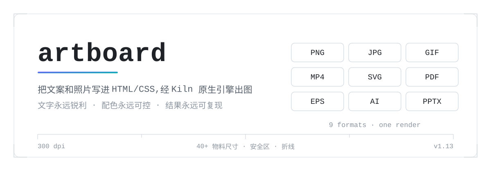
</p>

# artboard · HTML 海报工作室

**AI Agent Skill:让 AI 像设计师一样工作**——不调用 AI 生图,而是写 HTML/CSS、用真实摄影素材、按印刷规范排版,再经 Playwright 渲染成成品图。文字永远锐利,配色永远可控,结果永远可复现。

## 成品样例

| 小红书封面 | 电商大促(GIF 可动) | 科技发布 KV |
|---|---|---|
| 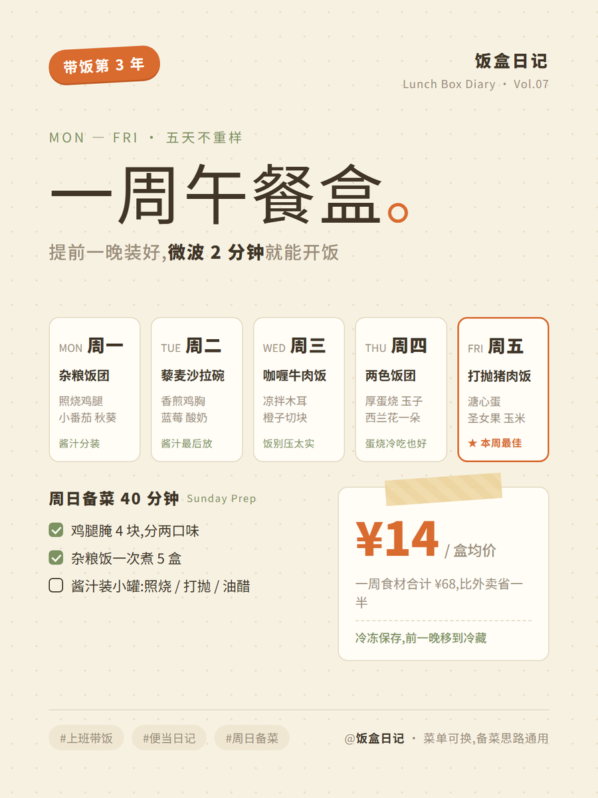 |  | 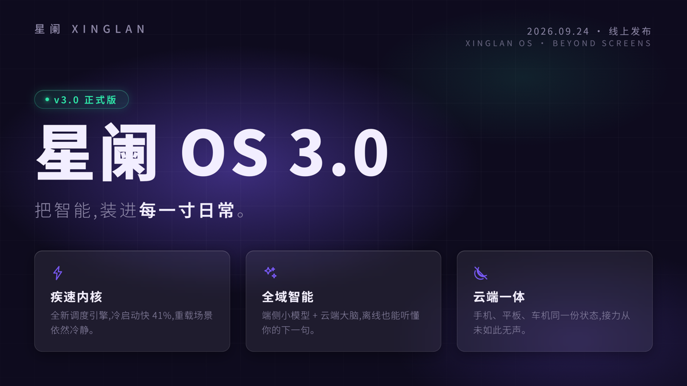 |
| **名片 · 正/背** | **三折页 · 正面** | **A4 海报** |
| 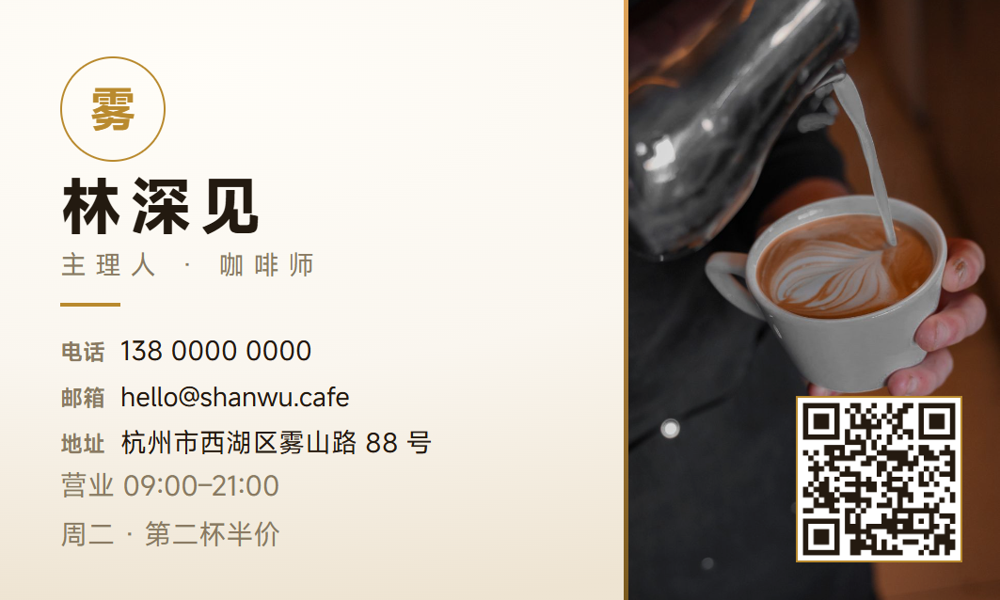 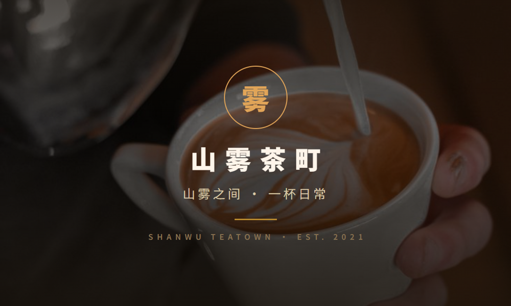 | 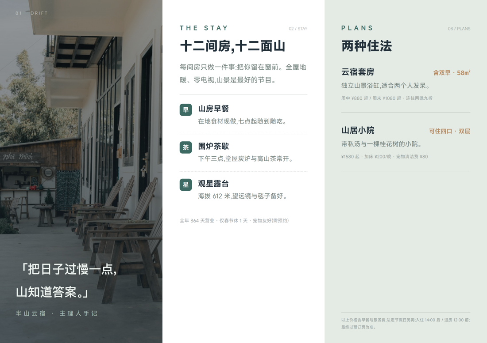 | 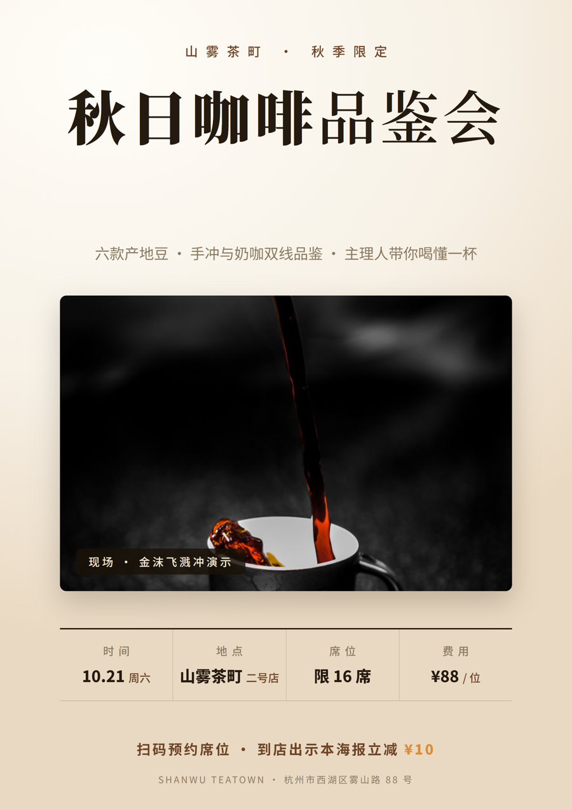 |
| **数据长图** | **易拉宝 80×200cm** | **三折页 · 背面** |
| 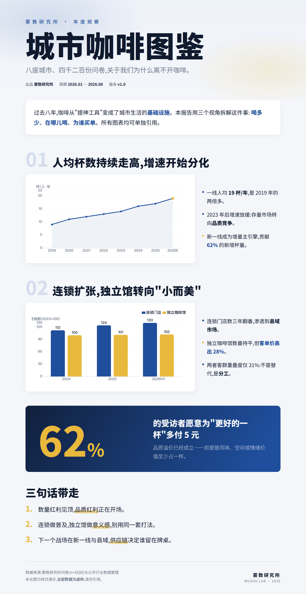 | 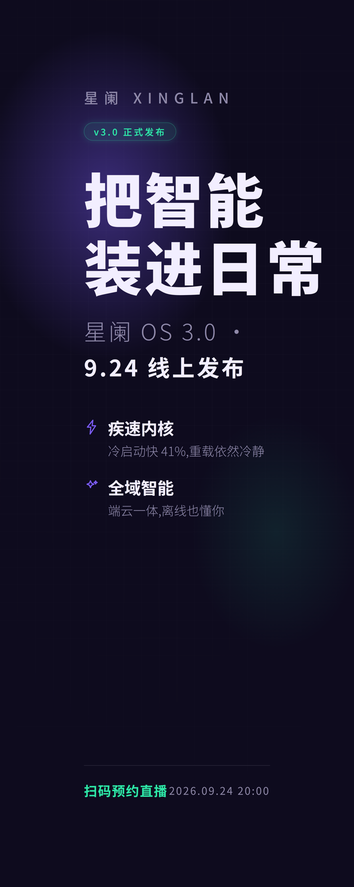 | 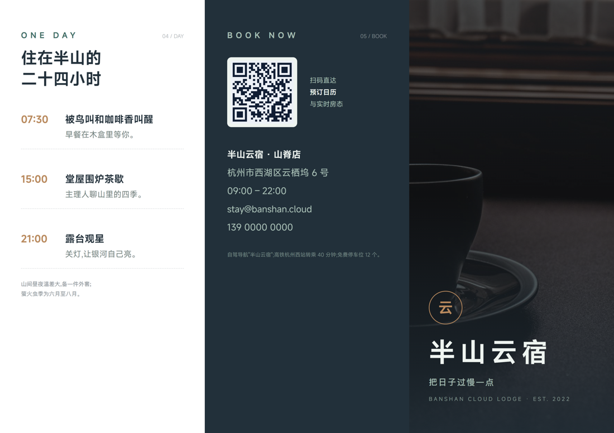 |

> 全部由本技能生成:Pexels 授权摄影 + 开源字体 + 手写 CSS 特效,300dpi 印刷直出。

## 它解决什么问题

AI 生图工具做海报的三座大山:**文字必糊、配色看运气、改一个字重跑一次**。artboard 反其道而行:

- **文字即 HTML**——标题、价格、条款永远锐利可编辑;
- **风格 = 可执行规则**——每个风格是一份"色彩角色表 + 字体栈 + 字号阶 + 禁则"的护栏分册,AI 在护栏内自由发挥,而不是套模板;
- **真实素材纪律**——产品图只认用户提供的,图库走 Pexels/Pixabay 授权源,爬虫素材自动打 `版权风险-` 标记并在交付时提醒更换。

## 工作流水线

<p align="center">
  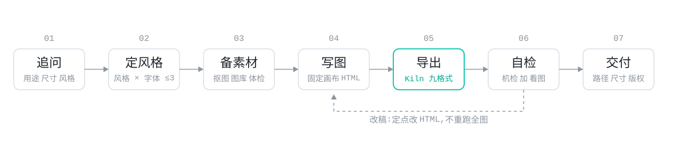
</p>

- **开工先追问**:内置五问协议(用途/尺寸/风格/配色/素材),拒绝拿到文案就盲做;
- **双路径导出**:WPI(Playwright 驱动系统 Edge/Chrome)为主,独立 Playwright 脚本兜底;
- **出图自检闭环**:渲染后自动看图检查溢出/对比度/字体加载,修复重导,2 轮上限;
- **动图**:CSS 动画 → GIF/MP4,迪士尼十二法则 + Material 缓动 token,无缝循环经帧差校验;
- **物料尺寸总表**:社媒/电商/印刷/办公/广告 40+ 物料的尺寸、安全区与设计法则([material-catalog.md](references/material-catalog.md))。

## 快速开始

把 `artboard/` 放进 Agent Skill 目录(如 `.agents/skills/`),复制 `config.example.json` → `config.json`,
**推荐双击 `tools\config-editorrtboard-config-editor.exe` 图形化填写**(小白免手改 JSON);
完整图解教程(环境一键部署 + Pexels/Pixabay Key 一步步申请)见 **[docs/setup.md](docs/setup.md)**。然后直接对话:

```text
「给山雾茶町做一张 88 会员日的咖啡促销方图,产品图我有」
「按这张图复刻内容,换成我们的品牌色」
「做一份三折页,A4 横,正面背面都要」
「这张 GIF 动图,循环 3 秒」
```

脚本也可独立使用:

```bash
python scripts/fetch_asset.py --query "coffee dark" --theme promo --download  # 搜图入库
python scripts/cutout.py product.jpg --sticker --shadow                       # 抠图+投影
python scripts/qr.py generate --data "https://…" --out img/qr.png --logo logo.png  # 品牌二维码
python scripts/qr.py decode poster.png                                        # 解析二维码内容
python scripts/export.py --source <项目>/src --output out.png \
    --width 1080 --scale 2 --height 1440                                      # 2x 高清导出
```

## 品类与尺寸

| 用途 | 预设 | 画布(px) | 导出 |
|---|---|---|---|
| 小红书 3:4 | `xhs` | 1080×1440 | 2x = 2160×2880 |
| 长图 / KV / 方图 / 竖屏 | `long` `kv` `square` `vertical` | 2400×auto 等 | 1–2x |
| 名片 90×54mm | `card` | 1063×638 | 1x = 300dpi |
| A4 海报 | `a4p` | 1240×1754 | 2x = 300dpi |
| 三折页(双面) | `trifold` | 1754×1240 | 2x = 300dpi + 合 PDF |
| 易拉宝 80×200cm | `rollup` | 2362×5906 | 2x = 150dpi |
| PPT 页 16:9 | `slide` | 1280×720 | 2x = 2560×1440 |

## 配置

环境统一在根目录 `config.json`(复制 `config.example.json`,已被 gitignore):

| 键 | 说明 |
|---|---|
| `wpi_path` | [WPI](https://github.com/GreenChennai/WPI) 渲染引擎路径(Playwright + 系统 Edge/Chrome);没有就跑 `python scripts/setup_wpi.py` 一键部署 |
| `studio_dir` | 海报项目与素材库落盘目录 |
| `pexels_key` / `pixabay_key` | 免费图库 API key([Pexels](https://www.pexels.com/api/) / [Pixabay](https://pixabay.com/api/docs/)) |
| `huaban_cookie` / `iconfont_cookie` / `pinterest_cookie` | 素材站 Cookie,用 [tools/cookie-extension](tools/cookie-extension/)(MV3)一键抓取 |
| `proxy` | 本地代理(Pinterest 等被墙站点用) |
| `ffmpeg` | 可选,启用 MP4 与高质量 GIF |

优先级:环境变量 > config.json > 默认值,改完即生效。

## 素材与版权政策

| 层级 | 来源 | 授权 |
|---|---|---|
| 1 | Pexels / Pixabay API | 免费商用免署名 |
| 2 | 爬虫(必应/百度/图标库/Pinterest/花瓣*) | **不确定** → 文件名自动加 `版权风险-`,交付时提醒更换 |

\* 花瓣 WAF 拦截程序化访问,走插件「导出本页素材」+ 剪贴板通道。产品实拍图**只能用户提供**——真实产品是品牌资产,图库没有也不该编。

## 目录结构

```
artboard/
├── SKILL.md                # Agent 入口:流水线 + 铁律
├── config.example.json     # 复制为 config.json
├── references/             # 追问/护栏/动效/素材/导出/风格系统/145 风格总表
│   ├── styles/             # 4 个视觉风格分册(+参考案例)
│   └── formats/            # 名片/A4/三折页/易拉宝/PPT 品类规范
├── scripts/                # preflight/scaffold/export/cutout/fetch_asset/vqa/add_font
├── fonts/                  # 中英 21 款开源字体(11 中文 + 10 英文点缀;仓库内置代表款,其余 fetch_font.py 按需下载)
├── assets/                 # ECharts/GSAP · Tabler 图标 · Open Doodles · 案例 HTML
└── tools/cookie-extension/ # 素材站 Cookie 助手(MV3,Edge/Chrome)
```

## 致谢

方法论与规则提炼自(思想借鉴,代码自写):[baoyu-skills](https://github.com/JimLiu/baoyu-skills)(MIT) · [diagram-design](https://github.com/cathrynlavery/diagram-design)(MIT) · [stylekit](https://github.com/AnxForever/stylekit)(MIT) · [html-anything](https://github.com/nexu-io/html-anything)(Apache-2.0) · [esther-design-system](https://github.com/esthersjw/esther-design-system)(CC BY-NC-SA,仅思想) · [Art](https://github.com/zhuxice-ctrl/Art)(仅特效原理) · [guizang-ppt/social-card-skill](https://github.com/op7418)(AGPL,仅踩坑规则思想) · [rembg](https://github.com/danielgatis/rembg)(MIT) · [Tabler Icons](https://github.com/tabler/tabler-icons)(MIT) · [Open Doodles](https://www.opendoodles.com/)(CC0)。字体:思源黑体/宋体、得意黑、霞鹜文楷、站酷快乐体。

## License

MIT
